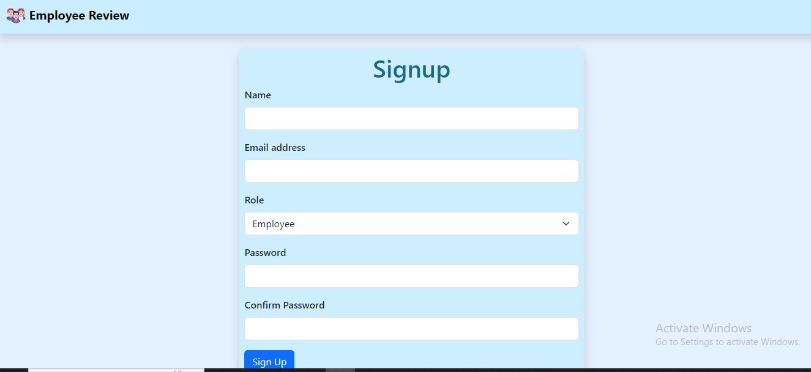
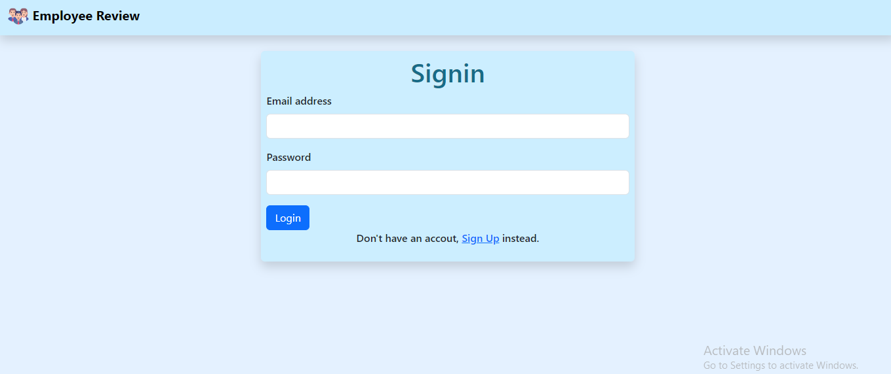
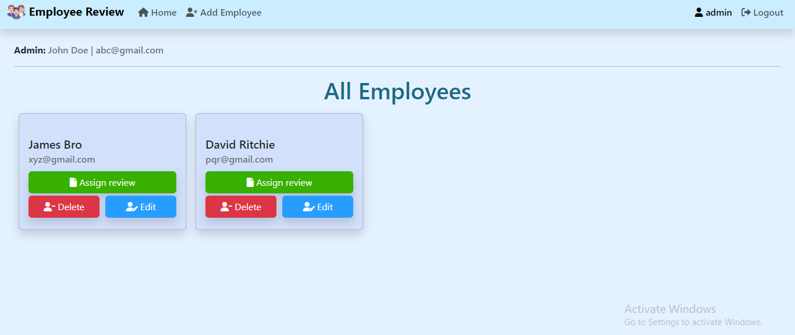
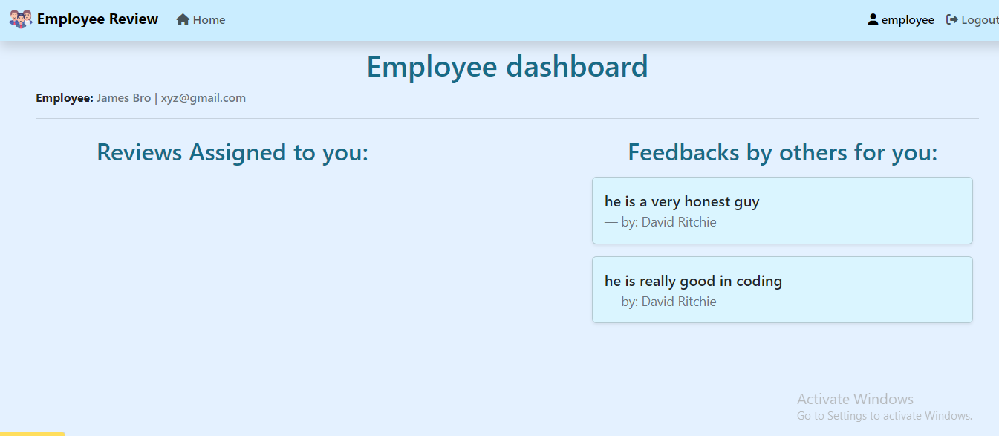
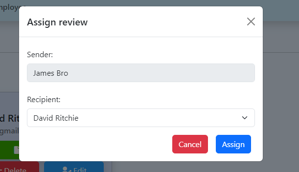
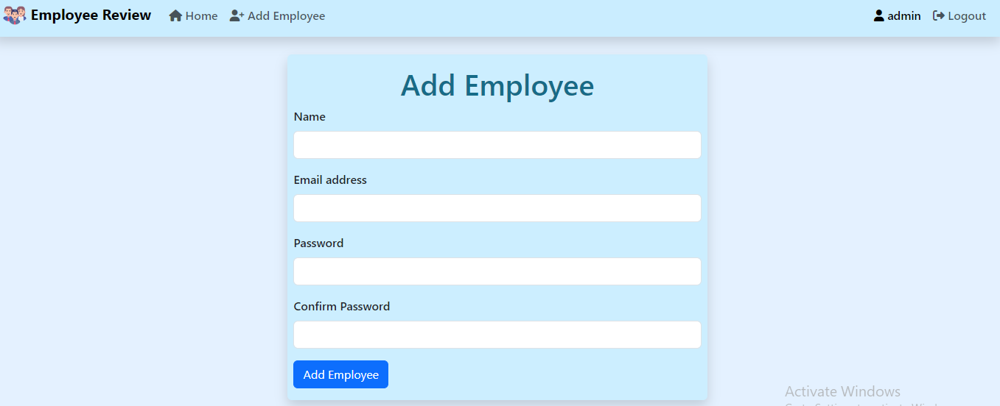
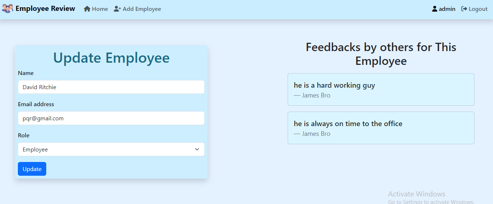

# Employee Review System
  This is an Employee Review System project of Coding Ninjas made using Nodejs, Expressjs in backend. MongoDB is used for database and for frontend it uses EJS(server side rendering). Any user can create their account with role either admin or employee. Both Admin and Employee can access different features.
  Admin can add, remove or update any user's data. Employee can give their feedback on other employees.

# ScreenShots:
  - Signup Page
  
 
  - Signin Page
  

  - Admin Dashboard Page
  

  - Employee Dashboard Page
  

  - Assign Review Page
  

  - Add New Employee Page
  

  - Update Employee Page
  

# Installation and Run 
  Follow these steps:
  - Get the code on your system.
  - Open terminal on your pc and navigate to the root directory of the project.
  - Run "npm install" command inside the terminal to install all the required dependencies.
  - Create a '.env' file inside root directory and define values for
      - PORT ( port on which your project will run )
      - MONGODB_URL ( URL of your mongoDB database for connecting to database )
      - SESSION_SECRET_KEY ( secret key for express-session )
  - Run 'npm start' command inside terminal to run the code.
  - Open your web browser and serach for 'localhost:{PORT}/' to see the output.

# Features
  - Create account with your role as " Admin / Employee "
  - Login using your email and password.
  - Store your session-token in DB so that logged in user's session will be safe.
  - Store all the data of employee, reviews in database.
  - Admin:
      - View list of all the employee.
      - Add a new employee.
      - Update data of any employee ( Name, email, Role ).
      - See review given to an employee.
      - Assign task to any employee ( review task : Giving review to other employee )
      - Delete any employee.
  - Employee:
      - See all the reviews given to him by other employee.
      - Give his review for other employee as assigned from admin.
  
# Tools used:
  - Nodejs
  - Expressjs
  - MongoDB
  - EJS
  - BootStrap
